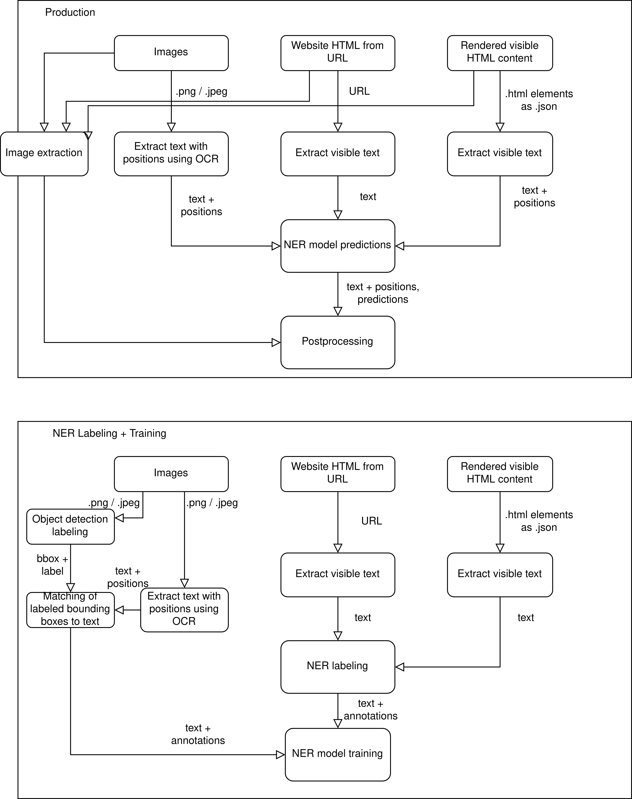

# arp-demo
Recipes training data samples upload


## Automatic recipe procesing (arp)

Automatic recipe processing is a microservice pipeline for processing and extracting recipes obtained from images or websites.
For the extraction of relevant recipe information (recipe name, ingredients, description...) Named Entity Recognition (NER) is used. 


### ARP NER Labeling & Training 




### Setup

``` 
python -m venv venv/
source venv/bin/activate
pip install -r requirements.txt
```

### Development

Start the FastAPI web server in development mode: `uvicorn main:app`

### Request

```json
[
  {
    "id": "image1.png",
    "text": "Käsekuchen\n\n3 Portionen...",
    "ocr": <Text object>   
  },
  ...
]
```